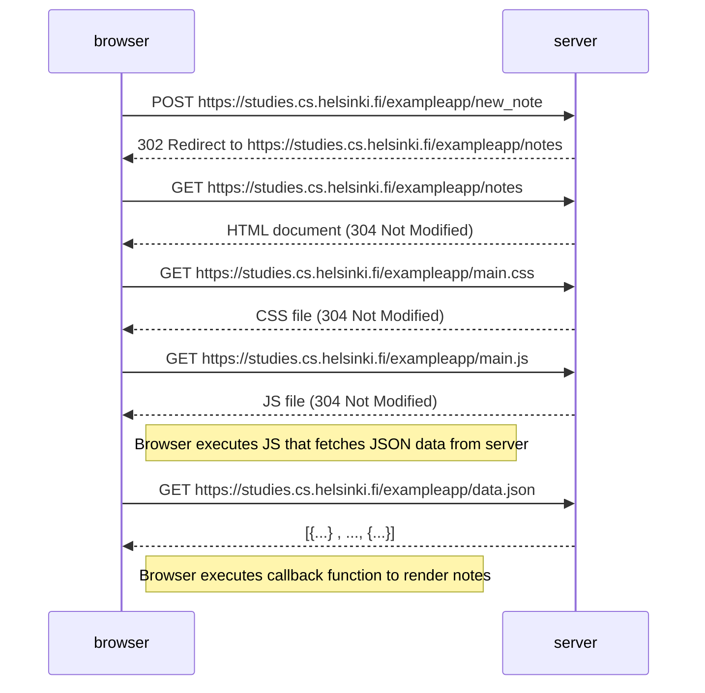

# Exercise 0.4 - New note diagram

## On button click the following sequence will occur:

```mermaid
sequenceDiagram
    browser->>server: POST https://studies.cs.helsinki.fi/exampleapp/new_note
    server-->>browser: 302 Redirect to https://studies.cs.helsinki.fi/exampleapp/notes
    browser->>server: GET https://studies.cs.helsinki.fi/exampleapp/notes
    server-->>browser: HTML document (304 Not Modified)
    browser->>server: GET https://studies.cs.helsinki.fi/exampleapp/main.css
    server-->>browser: CSS file (304 Not Modified)
    browser->>server: GET https://studies.cs.helsinki.fi/exampleapp/main.js
    server-->>browser: JS file (304 Not Modified)
    Note right of browser: Browser executes JS that fetches JSON data from server
    browser->>server: GET https://studies.cs.helsinki.fi/exampleapp/data.json
    server-->>browser: [{...} , ..., {...}]
    Note right of browser: Browser executes callback function to render notes
```